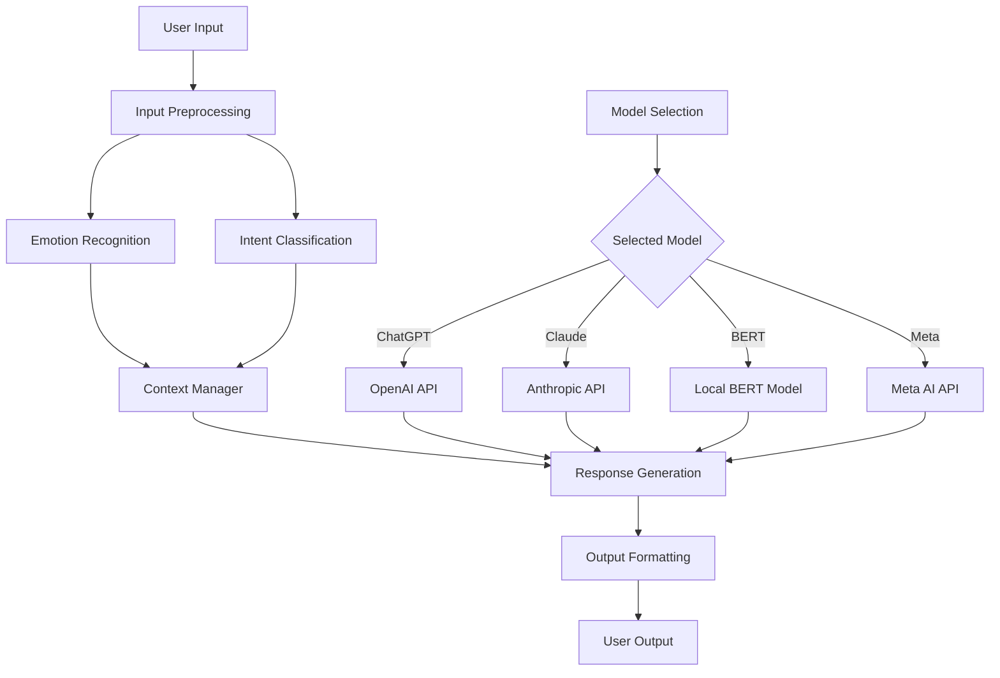

#Project structure 

emoticonnect-mvp/
│
├── src/
│   ├── __init__.py
│   ├── preprocessor.py
│   └── emotion_recognizer.py
│
├── tests/
│   ├── __init__.py
│   ├── test_preprocessor.py
│   └── test_emotion_recognizer.py
│
├── .env
├── .gitignore
├── main.py
├── requirements.txt
└── README.md

# emoticonnect
An app to help people in their emotional well being

Now, let's break down the tasks for developing this AI core capability:

Input Preprocessing

Task: Develop a module to clean and standardize user input
Target: Handle text input, remove special characters, normalize text
Evaluation: Test with various input types, ensure consistent output

Emotion Recognition

Task: Implement an emotion classification model
Target: Identify 5-7 basic emotions from text
Evaluation: Achieve >80% accuracy on a test dataset

Intent Classification

Task: Develop an intent classification system
Target: Identify 10-15 common user intents (e.g., seeking advice, venting, asking for information)
Evaluation: Achieve >75% accuracy on a test dataset

Context Manager

Task: Create a system to maintain conversation context
Target: Store and retrieve relevant information from the ongoing conversation
Evaluation: Successfully maintain context for conversations up to 10 turns long

Model Selection Interface

Task: Develop an interface to switch between different language models
Target: Support integration with ChatGPT, Claude, BERT, and Meta's models
Evaluation: Seamlessly switch between models without code changes

API Integration

Task: Integrate APIs for selected cloud-based models (ChatGPT, Claude, Meta)
Target: Successfully send requests and receive responses from each API
Evaluation: Achieve <500ms average response time for API calls

Local Model Integration (BERT)

Task: Set up a local BERT model for offline capabilities
Target: Fine-tune BERT for conversational AI tasks
Evaluation: Achieve comparable performance to cloud-based models

Response Generation

Task: Develop a module to generate appropriate responses based on emotion, intent, and context
Target: Create coherent and empathetic responses
Evaluation: Conduct user tests to ensure >80% satisfaction with responses

Output Formatting

Task: Create a module to format the AI response for user presentation
Target: Ensure consistent formatting regardless of the model used
Evaluation: Test with various response types and lengths

Development Timeline and Targets:
Week 1:

Days 1-2: Input Preprocessing and Emotion Recognition
Target: Complete modules with basic functionality
Days 3-4: Intent Classification and Context Manager
Target: Implement initial versions with test datasets
Day 5: Model Selection Interface
Target: Create a basic switching mechanism between models

Week 2:

Days 1-2: API Integration
Target: Successfully integrate at least two cloud-based models
Day 3: Local Model Integration (BERT)
Target: Set up and fine-tune BERT model
Days 4-5: Response Generation and Output Formatting
Target: Develop initial versions of both modules

Week 3:

Days 1-3: Testing and Refinement
Target: Conduct thorough testing of all modules
Days 4-5: Integration and End-to-End Testing
Target: Ensure all components work together seamlessly

Evaluation Metrics:

Accuracy of emotion recognition and intent classification
Response time of the entire system
Coherence and empathy of generated responses
Ease of switching between different language models
User satisfaction with the AI interactions

Flexibility Considerations:

Ensure that the Context Manager can adapt to different conversation styles of various models
Design the Response Generation module to leverage the unique strengths of each language model
Create a configuration file to easily adjust parameters for each model (e.g., temperature, max tokens)

