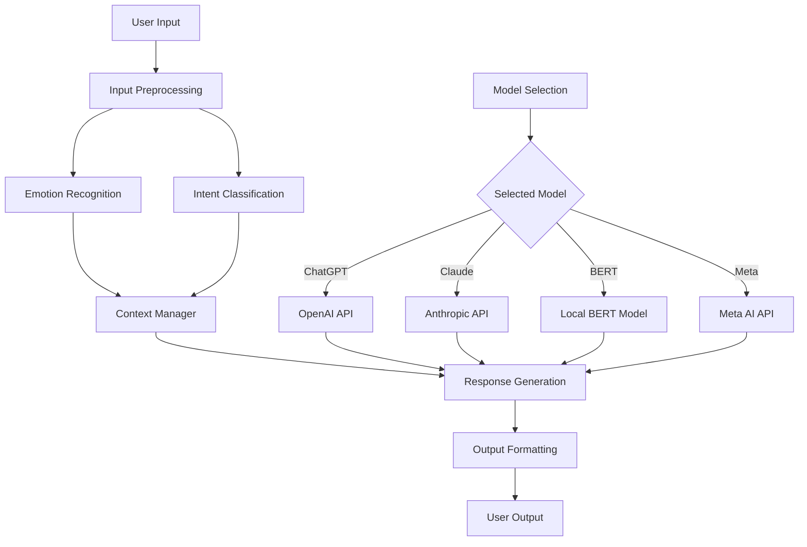

# emoticonnect
An app to help people in their emotional well being

```mermaid
graph TD
    A[User Input] --> B[Input Preprocessing]
    B --> C[Emotion Recognition]
    B --> D[Intent Classification]
    C --> E[Context Manager]
    D --> E
    E --> F[Response Generation]
    F --> G[Output Formatting]
    G --> H[User Output]
    I[Model Selection] --> J{Selected Model}
    J -->|ChatGPT| K[OpenAI API]
    J -->|Claude| L[Anthropic API]
    J -->|BERT| M[Local BERT Model]
    J -->|Meta| N[Meta AI API]
    K --> F
    L --> F
    M --> F
    N --> F
```
